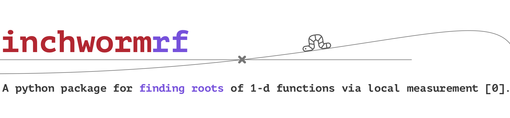
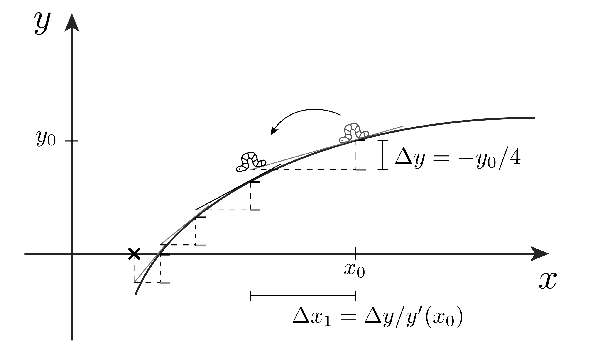

  


This package provides methods for finding roots of a function using only calls
to the derivatives of the function, never the function itself.

<em> This can be useful when:</em>

- Only local measurements are available.  E.g., when climbing a mountain, one
  may not have access to an elevation device, but one can measure the local
slope; Many fundamental physical quantities cannot be measured directly
(entropy, energy, etc.) but their derivatives can -- e.g., temperature,
tension, etc.
- When a numerical derivative function is provided, but access to the function
itself requires a costly numerical integration.  This can occur in applications
involving the integration of differential equations.

<em>Available strategies:</em>

  - <em>Inchworm method:</em>  This gradually inches towards a root, at each
    step attempting to reduce the function by a constant amount.  This method
    is preferred for highly curved functions, as it avoids "overshooting".
  - <em>Approximate Newton method:</em>  This method runs more quickly than the
    inchworm in our current python implementation, but can fail for highly
    curved functions.


[0] J. Landy and Y. Jho. Root finding via local measurement (2023)
[<a href="https://arxiv.org/abs/2302.13211">link</a>].

## Package information
### Example calls
```python
from inchwormrf import inchworm, newton

# goal: find fifth root of 3
y_function = lambda x: x ** 5 - 3

# derivatives -- note: accuracy improves w/ derivative count supplied
derivatives = [
    lambda x: 5 * x ** 4,                  # 1st derivative of y_function
    lambda x: 20 * x ** 3,                 # 2nd ...
    lambda x: 60 * x ** 2,                 # 3rd ...
]

# call the inchworm root finder
inchworm_root = inchworm(
    x0=2.0,                                # initial x value for search
    y0=y_function(2.0),                    # function value at x0
    N=10 ** 2,                             # inchworm steps to take
    derivatives=derivatives,               # ordered derivatives of y
    newton_pass=True                       # final newton hop to reduce error
)

# call the approximate Newton root finder
newton_root = newton(
    x0=2.0,                                # initial x value for search
    y0=y_function(2.0),                    # function value at x0
    N=10 ** 2,                             # derivative sample count
    iterations=10,                         # newton hops to take
    derivatives=derivatives,               # ordered derivatives of y
)

print(inchworm_root, newton_root, 3 ** 0.2)
>> (1.2457309311200724, 1.2457309395803384, 1.2457309396155174)
```

For an example where Newton's method fails but the inchworm does not, check
out (the highly-curved) `y = |x|^(1/4)` [0]. 

### Installation
The package can be installed using pip, from pypi

```
pip install inchwormrf
```

or from github

```
pip install git+git://github.com/efavdb/inchwormrf.git
```

### Tests, license
The test file contains many additional call examples.  To run the tests, call
the following from the root directory:

```
python setup.py test
```

This project is licensed under the terms of the MIT license.
 

## Implementation
### Inching process
Whereas most root finding methods (e.g., Newton's method, binary search, etc.)
attempt to iteratively refine a current best guess for a root of a function
`y`, the inchworm algorithm only generates a single root estimate at its
termination.  It works by "inching" towards the root:  If we start at a point
`(x0, y0)`, and we ask to run the algorithm over `N` steps, the worm will
attempt to move downhill by `dy = y0 / N` with each step.  It does this by
looking at the local geometry of the function at its current position -- the
slope, curvature, etc. [more formally: the worm evaluates the derivatives
passed to it, inverts the Taylor series for `y` that results, and then uses the
inverted series to estimate how far it needs to move in `x` to drop the
function by `dy`].  After completing `N` steps like this, the worm sits close
to a root (see figure).




<em>Figure, example inching process:</em> Our worm seeks a root in 4 steps.  At
each step, the worm measures the local slope, and uses this to estimate how far
it must move in `x` to drop `y` by `dy`.  The worm overshoots a bit here.  Its
accuracy could be improved by (1) increasing the step count, (2) utilizing
higher derivative information, or (3) ending with an approximate Newton hop to
refine the estimate.

### Approximate Newton hops
Newton's method involves iteratively fitting a line to a function at a current
location, and then moving to the root of this line, `x -> x - y / y'`.  In this
way -- assuming convergence -- we can often reduce the error in the root
estiamte exponentially fast.  Here, we intentionally do not allow calls to the
function itself, and so cannot read out the `y` value in the above formula.  To
proceed, we need to get an estimate `y_est` for `y`.  We get this by
approximating the integral of `y'` over the region we've covered so far.  The
accuracy of this approimation improves with the number of derivatives we have
available.  Our inchworm method makes use of the Newton hop method at the end
of its process -- when asked -- and the newton code exclusively applies this
process.


### Asymptotic error
If `k` derivatives are passed, and we take `N` steps, the inching process will
return a root estimate whose error scales asymptotically like `N^-k`.  This
means that we can improve our acccuracy by either increasing `N` or `k`.

If the optional, final Newton hop is taken, the root estimate returned will
scale asymptotically like `N^-(2 * (k // 2) + 2)`.  E.g., when `k = 1`
derivative is passed, this will give an error scaling as `N^-2` -- a big gain
over the `N^-1` scaling that we get without the hop.  Running the approximate
Newton method on its own results in this same scaling.


### Other available methods
We have written the `inchworm` method to be fully general -- it can accept any
number of derivatives.  Unfortunately, this flexibility causes the code to run
somewhat slower than a method that is "hard-coded" for a particular number of
derivatives.  This slowdown occurs mainly due to repeated list lookups that
occur within the algorithm's inching-process for loop.

To alleviate this issue, we have "hard-coded" the for loop for some of the
first simple cases here (for cases where up to 8 derivatives are passed).  Our
main `inchworm` program farms out to these when requested.  Directly calling
the hard-coded programs can give a modest, additional boost to speed.  See the
tests for example calls to these methods.

To max out the speed of the inversion approach, one should hard code the method
in a compiled language for the function of interest.  Our code here should be
relatively easy to port over.


## Additional information

### Authors

**Jonathan Landy** - [EFavDB](http://www.efavdb.com)

**YongSeok Jho** - [Gyeongsang National University](
https://sites.google.com/view/jholab/professor?pli=1)

### Acknowledgments
We thank S. Landy and P. Pincus for helpful feedback.
